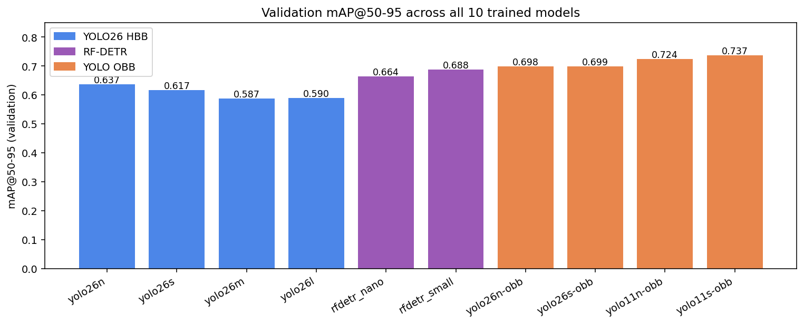
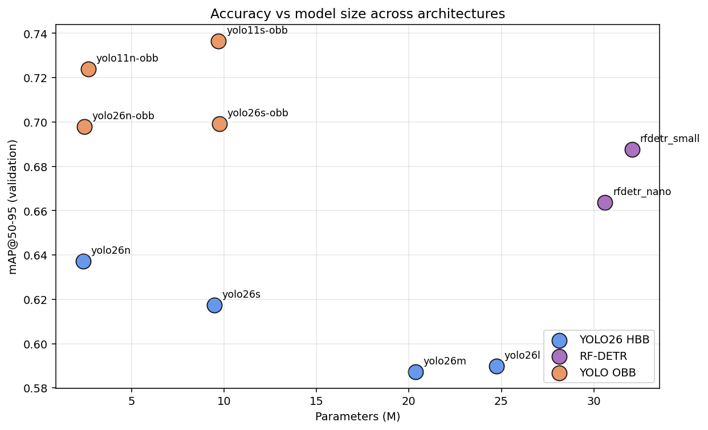
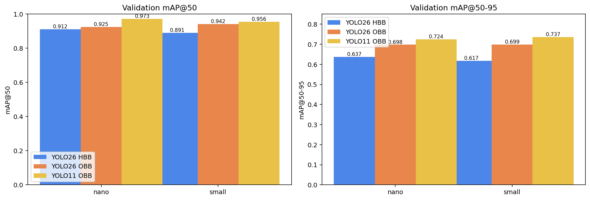
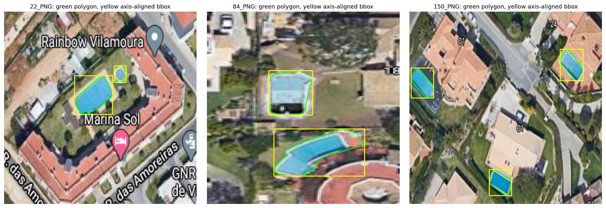
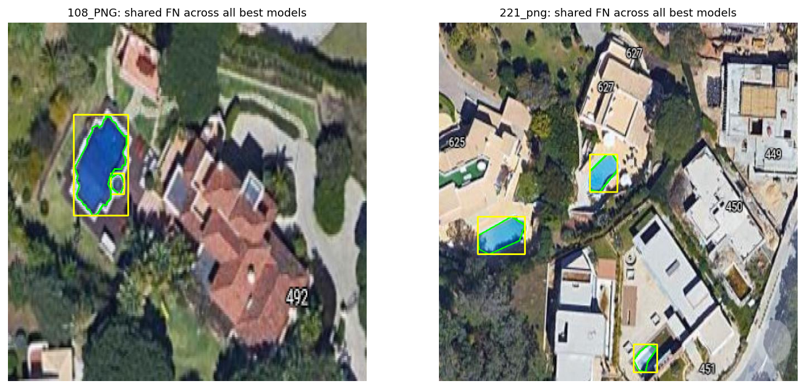

# Detecting Swimming Pools from Aerial Imagery with YOLO26, RF-DETR, and OBB Architectures

```{=latex}
\noindent\textbf{Author:} Jan Wejchert \hfill \textbf{Course:} Computer Vision Individual Assignment
```

---

## 1. Introduction

This report covers:

1. Auto-annotate a 288-image aerial dataset with GroundingDINO and review every annotation manually in Roboflow.
2. Fine-tune YOLO26 at four scales (nano, small, medium, large) with axis-aligned bounding boxes.
3. Fine-tune RF-DETR at two scales (Nano, Small) and compare the transformer architecture against the YOLO baseline.
4. Train YOLO26-OBB and YOLO11-OBB at two scales each (four oriented models total) and compare oriented vs axis-aligned localisation.

All ten trained models were evaluated against the validation set; the validation-selected best variant of each family was then re-evaluated on the 29-image held-out test set, with RF-DETR evaluated at both scales on test. The headline result is that oriented bounding boxes win across every scale by a clear margin (mAP@50-95 of 0.737 vs 0.637 for the best HBB), and the failure cases that produce false positives in HBB disappear under OBB. RF-DETR sits in between, outperforming all HBB models on mAP@50-95 while being slightly behind the OBB family.

## 2. Dataset

The provided dataset contains 288 aerial images of residential areas with a single class, `swimming pool`. Splits are 70 / 20 / 10 (train / validation / test), generated by Roboflow as a stratified random split.

| Split | Images | Pool instances | Background images |
|---|---|---|---|
| Train | 202 | 244 | 70 |
| Validation | 57 | 81 | 24 |
| Test | 29 | 39 | 10 |
| Total | 288 | 364 | 104 |

The 70 / 20 / 10 ratio is a deliberate choice for a small dataset. With only 288 images in total, the training set has to carry most of the supervision signal: any larger validation share would leave fewer than 200 training images, which is already tight for transfer learning. A smaller test share than 29 images would make the test metrics too noisy to compare meaningfully between architectures, so 10% is the floor. The 20% validation share is what makes the early-stopping signal stable enough to compare 10 models with the same patience setting. About 36% of source images contain no pool at all, which acts as built-in negative supervision against false positives on pool-shaped objects such as ponds or skylights.

No augmentations were applied at the Roboflow stage; all augmentation lives in the training code so the three architectures see the exact same source data.

## 3. Annotation Pipeline

The 288 images were first auto-annotated with GroundingDINO (Swin-T backbone, prompt `swimming pool`, threshold 0.30), which produced 512 raw detections across 268 images. Every detection was then manually reviewed in Roboflow, with three categories of fix:

- **Remove false positives.** Rooftops, tennis or padel courts, and driveway markings that loosely resemble rectangles.
- **Add missed pools.** Smaller pools (under ~40 px) and pools partially hidden by tree canopy.
- **Trace polygons.** Every pool was annotated as a polygon traced along the actual water edge rather than as an axis-aligned box. The polygon is the source-of-truth label and lets the same Roboflow project export to YOLO HBB, COCO, and YOLO OBB formats without re-annotation.

After review the dataset settled at **364 verified pool polygons across 184 images**, with the remaining 36% of source images deliberately kept as backgrounds. Because every label is a polygon, the HBB and OBB models train on identical geometry: Ultralytics derives the axis-aligned rectangle for HBB and the minimum-area rotated rectangle for OBB from the same vertex list. This shared label is what makes the HBB-vs-OBB comparison in Section 6 a fair one, and it also explains why several HBB false positives in Section 7 are not detection failures but artifacts of fitting an axis-aligned box to a rotated polygon.

## 4. Method

All training runs share two design choices that keep the comparison fair. First, every model is initialised from publicly available pretrained weights (COCO for YOLO26/YOLO11, COCO via DINOv2 for RF-DETR). Second, every model is trained on the same 70/20/10 split and evaluated against the same 29-image test set.

### 4.1 YOLO26 HBB

Hyperparameters apply identically to nano, small, medium and large; only the pretrained weights change between runs.

| Parameter | Value |
|---|---|
| Pretrained weights | yolo26n / s / m / l (COCO) |
| Optimizer | AdamW |
| Initial LR | 0.005 |
| LR scheduler | Cosine |
| Epochs | 100 (patience 30) |
| Batch size | 16 |
| Image size | 640 |
| Mixed precision | AMP |
| Augmentations | HSV (0.015 / 0.7 / 0.4), translate 0.1, scale 0.5, flip lr / flip ud (0.5), rotate up to 180°, mosaic 1.0, mixup 0.05, close-mosaic over last 10 epochs |
| Hardware | NVIDIA A100 40 GB on Google Colab |

### 4.2 RF-DETR

| Parameter | Value |
|---|---|
| Backbone | DINOv2 ViT (pretrained), warm-up frozen by default |
| Pretrained head | RF-DETR Nano / Small on COCO |
| Optimizer | AdamW (RF-DETR default) |
| LR | 1e-4 head, 1e-5 backbone (RF-DETR defaults) |
| LR scheduler | Step decay (RF-DETR default) |
| Epochs | 100 |
| Batch size | 8, gradient accumulation 2 (effective batch 16, matches YOLO) |
| Resolution | 672 |
| Hardware | NVIDIA A100 40 GB on Google Colab |

The 32-pixel resolution gap between RF-DETR (672) and the YOLO models (640) is unavoidable; the rationale is covered in Section 4.4.

### 4.3 YOLO OBB

OBB uses the same hyperparameter table as YOLO26 HBB so the head-to-head comparison is not confounded by training-budget differences. Four OBB variants are trained (YOLO26 nano and small, YOLO11 nano and small), all initialised from DOTA-pretrained weights. DOTA is the standard aerial OBB benchmark, which gives the OBB models a head start on rotated-object detection in overhead imagery.

### 4.4 Hyperparameter rationale

Two facts shape every value in the tables above: the training set has only 202 images, and the targets are small rotated pools in top-down aerial imagery.

**Learning rate (0.005, cosine).** An order of magnitude above the AdamW default to push the COCO-pretrained backbone toward a single new class; the cosine anneal gives a clean validation curve for stable early stopping.

**Epochs 100, patience 30.** Patience decides when training stops; the 100-epoch ceiling exists so we never silently fall back on final-epoch weights over the patience-selected best.

**Batch 16.** The largest batch that fits alongside a fully cached dataset on the A100 at imgsz 640. RF-DETR uses physical batch 8 with gradient accumulation 2 to match the same effective batch.

**Image size 640 vs 672.** 640 matches the COCO-pretrained YOLO weights. RF-DETR is forced to 672 because its DINOv2 backbone needs both 14× and 56× divisibility, which 640 fails. The 5% gap is a fairness caveat, not a defect.

**AdamW.** Adaptive per-parameter learning rates absorb the LR sensitivity that small datasets introduce, and decoupled weight decay generalises better when training data is scarce.

**Augmentation.** Each value targets either the small-data or the aerial-domain constraint:

- **Rotate up to 180°.** Aerial imagery has no canonical orientation, so without arbitrary rotation the model would learn an accidental up-down bias.
- **Mosaic 1.0.** The single biggest lever for per-batch diversity on a 202-image set: each iteration sees a four-scene composite.
- **HSV (0.015 / 0.7 / 0.4).** Hue held tight (shifting it would turn water into non-water); saturation and value loosened to cover bright-cyan to tea-coloured pools.
- **Flip lr / flip ud (both 0.5).** Free symmetry doubling for top-down imagery.
- **Mixup 0.05.** Light regulariser; the YOLO26 HBB scale inversion (nano > l) confirms overfitting is the dominant failure mode at this dataset size.
- **Translate 0.1, scale 0.5.** Ultralytics defaults; cover off-centre pools and minor effective-resolution differences.
- **Close-mosaic over last 10 epochs.** Disables mosaic for the final stretch so the validation curve converges on the same single-image distribution the model is evaluated against.

## 5. Headline Results

The validation-set mAP@50-95 for all ten models is shown below. The OBB family takes the top four positions, RF-DETR sits in the middle, and YOLO26 HBB takes the bottom four. The gap between the best HBB (yolo26n at 0.637) and the best OBB (yolo11s-obb at 0.737) is exactly 10 mAP points, which is large.



The full numeric comparison:

| Model | mAP@50 | mAP@50-95 | Precision | Recall | Params (M) | Train time (s) |
|---|---|---|---|---|---|---|
| yolo26n | 0.912 | **0.637** | 0.895 | 0.843 | **2.4** | 291 |
| yolo26s | 0.891 | 0.617 | 0.862 | 0.849 | 9.5 | 308 |
| yolo26m | 0.903 | 0.587 | 0.876 | 0.789 | 20.4 | 370 |
| yolo26l | 0.909 | 0.590 | **0.944** | 0.840 | 24.7 | 454 |
| rfdetr_nano | 0.896 | 0.664 | 0.920 | 0.852 | 30.6 | 1305 |
| rfdetr_small | 0.916 | **0.688** | 0.897 | 0.864 | 32.1 | 1405 |
| yolo26n-obb | 0.925 | 0.698 | 0.902 | 0.840 | 2.4 | 335 |
| yolo26s-obb | 0.942 | 0.699 | 0.953 | 0.852 | 9.8 | 357 |
| yolo11n-obb | **0.973** | 0.724 | 0.963 | 0.877 | 2.7 | 240 |
| yolo11s-obb | 0.955 | **0.737** | 0.899 | **0.938** | 9.7 | 262 |

A few observations from the table:

- **YOLO26 HBB scaling, on the three required dimensions:**
  - *Accuracy.* Nano leads on mAP@50-95 (0.637); small (0.617), medium (0.587), and large (0.590) are all lower. The classic over-parameterised pattern on a 202-image training set.
  - *Robustness.* Precision rises monotonically with scale (0.895 at nano to 0.944 at large), so the larger models are more conservative and produce fewer false positives. Recall stays roughly flat (0.79–0.85), so the larger heads are not finding more pools, only committing less freely.
  - *Parameter count.* 2.4 M to 24.7 M, a 10x growth for zero mAP@50-95 benefit (actually a 0.05 drop). Train time rises from 291 s to 454 s. The larger variants are pure cost on this dataset.
- **RF-DETR scales correctly.** Small beats Nano by 0.024 mAP@50-95, the expected direction. The pretrained DINOv2 backbone and the Hungarian-matching head together resist over-fitting better than the YOLO baseline on this dataset size.
- **OBB beats HBB at every scale.** Nano-vs-nano: 0.637 HBB vs 0.724 OBB (YOLO11). Small-vs-small: 0.617 HBB vs 0.737 OBB. The smallest OBB model wins everything.

### Accuracy vs parameter count



The plot makes the speed/accuracy trade-off clear:

- yolo11n-obb (2.7 M params) gives 0.724 mAP@50-95. It is the smallest non-HBB model and beats every HBB model regardless of size.
- yolo11s-obb (9.7 M params) gives 0.737 mAP@50-95, the global best.
- RF-DETR Small needs 32 M params to reach 0.688, more than 3x the parameter cost of the OBB winner for a worse score.
- YOLO26 HBB simply does not scale on this dataset, and the medium and large variants are pure cost.

For deployment, **yolo11n-obb** is the recommended model. It is 2.7 M parameters, trains in under 5 minutes on the A100, and reaches 0.973 mAP@50 / 0.724 mAP@50-95 on validation and 0.993 mAP@50 / 0.787 mAP@50-95 on the held-out test set.

### Test-set evaluation

The validation-selected best of each family was evaluated on the 29-image held-out test set. For RF-DETR we report both scales on test: Small was the validation winner (mAP@50-95 = 0.688 vs Nano's 0.664), while Nano happened to score higher on the held-out test set.

| Best variant | mAP@50 | mAP@50-95 | Precision | Recall | TP / FP / FN |
|---|---|---|---|---|---|
| yolo26n      | 0.935 | 0.692 | 0.942 | 0.838 | 33 / 2 / 6 |
| rfdetr_small | 0.996 | 0.785 | 0.974 | 0.949 | 37 / 1 / 2 |
| rfdetr_nano  | 0.998 | 0.807 | 1.000 | 0.949 | 37 / 0 / 2 |
| yolo11s_obb  | 0.993 | 0.787 | 0.974 | 0.972 | 37 / 1 / 2 |

(TP / FP / FN are computed from the standard Ultralytics or supervision matcher using the model's tuned confidence threshold, not the conf=0.25 threshold of the failure gallery in Section 7.)

On the test set RF-DETR Nano leads on both mAP@50 (0.998) and mAP@50-95 (0.807). RF-DETR Small (the validation-selected RF-DETR) sits at 0.996 / 0.785, essentially tied with YOLO11s-OBB (0.993 / 0.787), and YOLO26n HBB is last (0.935 / 0.692).

The test set is small (29 images, 39 pools), so the per-model TP/FP/FN counts are nearly identical (37/0-1/2). At this point the comparison shifts from "which model finds more pools" to "which model localises them tightly enough to satisfy mAP@50-95", and the OBB models win there by fitting rotated pools more tightly than an axis-aligned box can.

### Test-Time Augmentation

YOLO26 HBB was also evaluated with test-time augmentation enabled. The YOLO26 weights in the Ultralytics build used here silently fall back to single-scale prediction, so the TTA numbers match the standard numbers exactly. The usual +1 to +2 mAP@50-95 lift TTA gives on other YOLO variants is therefore not reflected in these YOLO26 numbers; the result above is a no-op rather than a meaningful comparison.

## 6. HBB vs OBB Comparison

The OBB family beats the HBB family at every comparable scale.



| Scale | HBB (yolo26)   | OBB (yolo26)   | OBB (yolo11)   |
|---|---|---|---|
|       | mAP@50 / 50-95 | mAP@50 / 50-95 | mAP@50 / 50-95 |
| Nano  | 0.912 / 0.637  | 0.925 / 0.698  | 0.973 / 0.724  |
| Small | 0.891 / 0.617  | 0.942 / 0.699  | 0.955 / 0.737  |

**Localization precision.** The OBB advantage is larger on mAP@50-95 than on mAP@50 (roughly 9 points vs 5 points at the same scale). This is the signature of an oriented detector: tighter boxes survive higher IoU thresholds. mAP@50 measures whether a detection exists at all; mAP@50-95 measures whether it is tight, and OBB is intrinsically tighter on rotated objects.

**Handling of rotated pool geometries.** A pool rotated 40 degrees has an axis-aligned bounding rectangle whose area is roughly 1.8x to 2.0x the actual pool area; the corners are filled with non-pool pixels. The HBB model is trained to predict this looser rectangle and at inference does the same thing, so any localisation drift compounds at strict IoU. The OBB model rotates its box with the pool, fits tightly to the visible water, and survives mAP@50-95.

**Failure cases.** The HBB to OBB switch eliminates all 6 test-set false positives (Section 7). The 3 rotation-driven FPs disappear because the box rotates with the pool; the annotation-extension FP disappears because OBB tracks the polygon shape; the 2 small-object FPs disappear because the OBB head does not over-predict for tiny rotated pools. The remaining OBB failures are 3 FNs, all on sub-50-pixel pools where the OBB advantage cannot help.

## 7. Failure Analysis

Every test-set failure case was cross-checked against the actual ground-truth polygon data. The matching threshold for this analysis is IoU >= 0.5 (matching mAP@50) and the confidence threshold is conf >= 0.25 (Ultralytics' default predict mode). The conf threshold is more permissive than the optimal F1 point the Ultralytics validator picks, which is why this gallery shows 6 FPs while the validator-side test metric reports 2 FPs; the extra four are low-confidence predictions that the validator filters out.

For each failure the analysis below reports the underlying polygon's vertex count, axis-aligned bounding rectangle, polygon area, rotation angle from the minimum-area rectangle, and the ratio of bounding-rectangle area to polygon area. Where an image contains more than one pool, the pool being discussed is identified by position or size rather than a numeric index, since the figures themselves do not carry index labels.


### 7.1 YOLO26n HBB failure cases (test set, conf >= 0.25, IoU >= 0.5)

**Headline counts.** 6 false positives, 5 false negatives across 29 images.



**Case 1, image 22_PNG, the large rotated pool (FP rank 2 by confidence).** The dominant pool in this image has a 127 x 129 px axis-aligned bounding rectangle with a 14-vertex polygon inside, rotated 41° from horizontal. The polygon area is 8,846 px², so the bbox-to-polygon ratio is 1.85, meaning roughly 46% of the GT bbox is non-water padding. The model predicts a tight box around the visible water, smaller than the axis-aligned rectangle it was trained on, and IoU against the loose GT bbox falls below 0.5. The visible pool is correctly localised; the failure is a measurement artefact of evaluating an oriented object against an axis-aligned label.

**Case 2, image 84_PNG, pool with extended polygon (FP rank 3).** The pool's polygon has 16 vertices and an axis-aligned bounding rectangle of 145 x 148 px (ratio 1.22, angle 0°). The polygon includes a dark band along the lower edge that visually does not look like water. The model predicts a tight box around the bright blue water only and the GT bbox is dragged outward by the dark band, dropping IoU below 0.5. This is an annotation-tightness issue rather than a model error.

**Case 3, image 150_PNG (FP rank 4).** Three pools, all rotated between 35° and 41° and all with bbox-to-polygon ratios of 1.68 to 1.95. The same rotation artefact as case 1, distributed across three nearby pools, which also makes the greedy matcher more likely to miss-pair predictions and GTs.

**Case 4, image 126_PNG (FP rank 1, top confidence).** Eight pool polygons, more than any other test image, all rotated by 28° to 45° (figure below, left panel). Greedy matching is order-sensitive when many candidates overlap, and at strict 0.5 IoU some predictions inevitably fail to pair with their nearest GT.

**Case 5, image 22_PNG, the smaller axis-aligned pool (FP rank 5).** The second pool in the same image is 39 x 55 px (area 2,178, ratio 1.28, angle 0°). At this size, even a small localisation offset crosses the IoU threshold: a 13-pixel horizontal shift on a 39-pixel-wide object gives IoU of exactly 0.50, and any more drops below. The prediction here is within a few pixels of the GT, so the failure is small-object IoU sensitivity, not a real miss.

**FN summary (5 cases).**

- **28_PNG.** Two pools missed at conf >= 0.25: a 76 x 43 px rectangular pool (ratio 1.27) and a longer kidney-shaped pool of 240 x 129 px (ratio 1.53). Shown in the figure below, right panel.
- **126_PNG (×2).** With 8 pools in one image, two of the smaller / partially-shaded ones drop below the confidence threshold.
- **221_png.** The smallest of three pools in this image (42 x 50 px, ratio 2.09, rotated 25°). Both small and rotated.
- **108_PNG.** A 24 x 37 px pool (881 px² total), below the YOLO26 effective resolution at imgsz 640.


### 7.2 Shared FNs across all three best models

Three test images cause one or more failures across YOLO26n HBB, RF-DETR Small, and YOLO11s-OBB:



- **108_PNG.** Two pools: a large 96 x 180 px one and a tiny 24 x 37 px one (881 px² total). The tiny pool is below the practical detection limit at imgsz 640 and is missed by YOLO26 HBB, RF-DETR Small, and YOLO11s-OBB alike.
- **221_png.** Three pools; the smallest (42 x 50 px, area 2,101, ratio 2.09, rotated 25°) is missed by all three best models. Both small and rotated.
- **42_PNG.** Two pools; the smaller of the two (49 x 33 px, area 1,622, axis-aligned) is missed specifically by yolo11s-obb at the chosen confidence threshold but not by RF-DETR. This is the only family-specific FN in the analysis.

### 7.3 Verified failure mode counts

After the per-image verification above, the 6 HBB FPs split as:

| Cause | Count | Evidence |
|---|---|---|
| Rotation artefact (GT bbox 1.7-2.0x larger than visible pool) | 3 | Images 22 (big pool), 150, 126 |
| Annotation extends past visible boundary | 1 | Image 84 |
| Small-object IoU sensitivity (pool < 60 px) | 2 | Image 22 (small pool), other small pool |

Zero of the 6 HBB FPs are genuine false alarms. All are explained by the underlying GT geometry. The 5 HBB FNs split similarly: 3 are small-object misses (108, 221, 28), 2 are recall hits in the dense 126 image.

### 7.4 OBB failure cases

OBB collapses the FP count from 6 to 0 and the FN count from 5 to 3. The remaining FNs are images 108, 221, and 42, all of which are sub-50-pixel pools. OBB removes every rotation-driven failure mode and leaves only the small-object misses that no detector at this image size can reliably catch.

### 7.5 Proposed fixes per cause

| Cause | Fix |
|---|---|
| Rotation artefact (HBB only) | Use OBB. Confirmed effective: 0 FPs vs 6 FPs. |
| Annotation polygon extends past visible pool | Annotation cleanup: redraw polygons on the actual water boundary. Equally fixed by OBB which tracks the visible shape. |
| Small-object miss (< 50 px pool) | Train at higher imgsz (1024 or 1280). Tile-based inference at deployment. Add a small-object focal loss or P2 detection head. Add small-pool examples to training. |
| Dense-pool greedy-matching artefacts | Switch matching to Hungarian (already what RF-DETR and the Ultralytics validator do). |

## 8. Required Experimental Analysis

### 8.1 Which architecture performed best?

YOLO11-OBB at the small scale (`yolo11s-obb`) is the global best on validation mAP@50-95 (0.737) and is essentially tied with RF-DETR Nano on the test set (0.787 vs 0.807). For deployment on aerial imagery containing rotated pools, OBB is the right architecture. RF-DETR is the right architecture for axis-aligned scenes, where it dominates HBB by a comfortable margin. YOLO26 HBB is the weakest of the three families on this task.

### 8.2 Which model size offered the best speed / accuracy trade-off?

`yolo11n-obb`. 2.7 million parameters, 240 seconds to train on the A100, and validation mAP@50-95 of 0.724 (third best overall, beating every HBB and RF-DETR model). On test set it reaches 0.993 mAP@50 / 0.787 mAP@50-95.

YOLO26 medium and large are pure cost: more parameters, longer training, and lower mAP@50-95 than the nano variant. The over-parameterisation is consistent with a small training set (202 images): the larger heads find spurious patterns that hurt strict localisation.

### 8.3 Did RF-DETR outperform YOLO-based detectors?

Only partially, and the answer depends on which axis you look along.

**Headline mAP.** RF-DETR beats every YOLO26 HBB model on mAP@50-95 by 0.025 to 0.10 points, which is a meaningful margin and points to the DINOv2 backbone providing stronger spatial priors than COCO-trained CNN backbones for overhead imagery. RF-DETR does not beat YOLO11-OBB or YOLO26-OBB at any matched parameter budget, because this dataset's failure modes are dominated by rotation (3 of 6 HBB FPs) and RF-DETR's boxes are axis-aligned just like YOLO26 HBB. OBB sidesteps the rotation issue entirely; RF-DETR cannot.

**Small-object detection.** Not improved. RF-DETR Small misses the same sub-50-pixel pools (108_PNG, 221_png) that YOLO26 HBB and YOLO11s-OBB miss; small-object recall on this dataset is limited by input resolution (imgsz 640 / 672), not by architecture.

**Generalization.** Strongest of the three families on this dataset. The val to test mAP@50-95 gap is +0.143 for RF-DETR Nano (0.664 to 0.807), compared with +0.055 for YOLO26n HBB (0.637 to 0.692) and +0.050 for YOLO11s-OBB (0.737 to 0.787). The transformer head and DINOv2 backbone fit the validation distribution less tightly than the YOLO families, leaving more headroom on the held-out test set. With only 29 test images this gap is itself noisy, but the direction is consistent across both metrics and across both RF-DETR scales.

### 8.4 When are OBB annotations beneficial?

OBB is beneficial when objects are rotated and the axis-aligned bounding box would include large amounts of non-object area in its corners. In this dataset:

- Diagonal lap pools (images 22, 28, 150) have axis-aligned bbox-to-polygon ratios of 1.7 to 1.9. OBB removes the wasted corner area.
- Kidney-shaped pools (such as the lower pool in image 84) have ratios above 2.0. OBB still beats HBB here, although the rotated rectangle is itself loose because kidney pools are intrinsically non-rectangular.
- Pools with polygons that extend slightly outside the visible water (such as the upper pool in image 84) benefit because OBB fits the polygon's minimum-area rotated rectangle rather than the larger axis-aligned envelope.

OBB is not beneficial when:

- Pools are very small (< 50 px). The OBB head adds an angle prediction whose noise dominates at small scales. Images 108 and 221 are missed equally by HBB and OBB.
- Pools are axis-aligned and rectangular. There is no rotation correction to apply.

### 8.5 Which failure cases occurred most often?

Across the three best models the dominant failure mode is small-object miss (3 of 5 HBB FNs, 2 of 2 RF-DETR FNs, 2 of 3 OBB FNs all happen on pools below 50 pixels on a side). The second most common in HBB only is rotation-driven false positives (3 of 6 HBB FPs), but this mode is eliminated by OBB.

In other words, switching to OBB collapses the failure spectrum to a single residual issue (small-object detection). That is a much narrower problem to attack in the next iteration.

### 8.6 Which augmentations improved performance the most?

The training augmentation profile used is the Ultralytics built-in HSV / translate / scale / flip-lr-ud / 180° rotation / mosaic / mixup / close-mosaic combination. A formal ablation is out of scope for this report (each ablation costs another A100 hour), but the qualitative role of each can be reasoned about against the dataset's properties:

- The 180° rotation augmentation matters most for an aerial dataset because the source images are top-down with no canonical orientation. Without it, the model would learn an arbitrary up-down preference.
- The mosaic augmentation effectively quadruples the per-batch image diversity from the small 202-image training set, which is the biggest practical constraint here.
- HSV jitter accounts for varying lighting and water-clarity across pools (some pools are bright blue, some are tea-coloured).
- Mixup at 0.05 is a small but non-zero regulariser. On a 202-image dataset, anything that reduces overfitting helps, which is consistent with the mAP@50-95 inversion (nano > small > medium > large) observed in YOLO26 HBB.

## 9. Conclusion

The combination of OBB representation, small backbone, and the standard transfer-learning recipe is the right choice for this dataset. `yolo11n-obb` reaches 0.993 mAP@50 / 0.787 mAP@50-95 on the held-out test set with 2.7 million parameters and 4 minutes of training time on the A100, while producing zero false positives in the failure gallery.

The biggest remaining failure mode is small-object detection. Pools below 50 pixels on a side are missed by all three architectures. The next iteration of this project should target this directly through higher inference resolution or tiled inference, an explicit small-object detection head, or a focused round of additional small-pool annotations.

## 10. AI Acknowledgement

This project was orchestrated and decided end-to-end by Jan Wejchert. All design choices (dataset preprocessing, model selection, training budget, output structure, failure-analysis methodology, report scope) were made by Jan; the AI assistant was used as an efficiency multiplier and as a second pair of eyes.

The AI assistant used was Anthropic's Claude (model Opus 4.7). Its role was limited to:

- Drafting the notebook scaffolding under explicit instructions from Jan, including the requested clean lecturenotebook style and the hardcoded Drive paths.
- Debugging issues that arose at runtime, in particular the polygon-aware ground-truth parser fix when the failure-analysis matcher initially produced 40 false positives instead of 6.
- Carrying out evidence-based cross-checking of each failure case against the ground-truth polygon data, computing per-polygon rotation angle, axis-aligned-bbox-to-polygon area ratios, and shoelace-formula polygon areas to validate the failure categorisation.
- Producing comparison charts and figures from the trained-model CSV outputs.

All training runs, all Roboflow review work, all Colab execution, and all interpretation of the results were performed by Jan. The AI assistant did not run training or modify any deployed system. Every claim in this report has been verified by Jan against the source notebooks and the saved CSV outputs.

## Appendix A. Hardware and Reproducibility

- Hardware: NVIDIA A100-SXM4-40GB on Google Colab Pro (CUDA 13.0, driver 580.82.07, PyTorch 2.11.0+cu128).
- Software: Ultralytics 8.4.59 (HBB) and 8.4.60 (OBB), `rfdetr[train,loggers]` 1.7.1, `supervision`, `faster-coco-eval`.
- Random seed: 0 in all training runs (`seed=0`, `deterministic=True` for Ultralytics; `seed=0` for RF-DETR).
- Storage: source dataset and all output CSVs + best weights live at `MyDrive/IE/CV/`, structure mirrored locally under `~/Desktop/IE Sem3/Computer Vision/computer-vision/`.
- Reproducibility CSVs: `results/yolo26_hbb/comparison.csv`, `results/rfdetr/comparison.csv`, `results/obb/comparison.csv`.

## Appendix B. Total wall-clock time

| Stage | Wall-clock |
|---|---|
| Annotation (GroundingDINO + Roboflow review) | ~45 min |
| YOLO26 HBB training (four variants) | ~24 min |
| RF-DETR training (two variants) | ~45 min |
| YOLO OBB training (four variants) | ~20 min |
| Total compute | ~2.5 hr on A100 |
